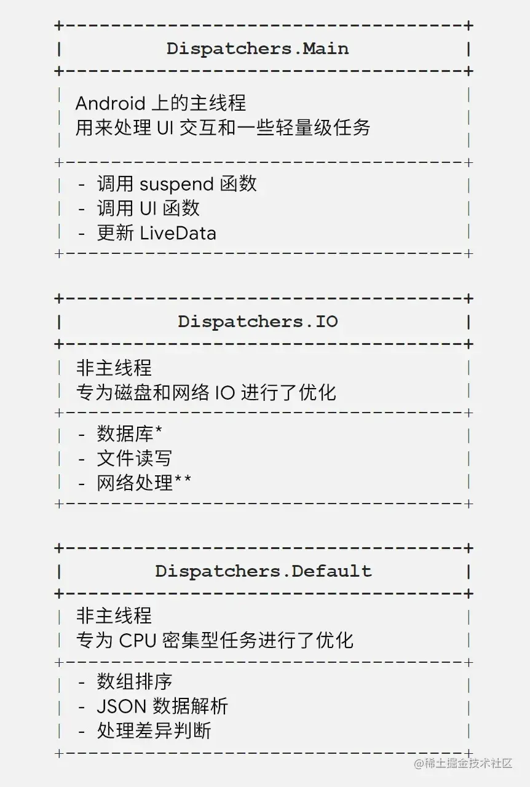

原文链接：https://blog.csdn.net/qq_17798399/article/details/95245996
————————————————————————————————————————————————————————————————————————————————————————————————————
# 1、初识协程:
首先我们来看一眼协程是什么样的, 以下引用了官网的一个例子:

fun main(args: Array<String>) {
launch(CommonPool) {//协程体
    delay(1000L)
    println("World!")
}
println("Hello,")
Thread.sleep(2000L)
}


/*
运行结果: ("Hello,"会立即被打印, 1000毫秒之后, "World!"会被打印)
Hello,
World!
*/
运行流程:
A. 主流程:

调用系统的launch方法启动了一个协程, 跟随的大括号可以看做是协程体.
(其中的CommonPool暂且理解成线程池, 指定了协程在哪里运行)
打印出"Hello,"
主线程sleep两秒
(这里的sleep只是保持进程存活, 目的是为了等待协程执行完)

B. 协程流程:

协程延时1秒
打印出"World!"
解释一下delay方法:
在协程里delay方法作用等同于线程里的sleep, 都是休息一段时间, 但不同的是delay不会阻塞当前线程, 而像是设置了一个闹钟, 
在闹钟未响之前, 运行该协程的线程可以被安排做了别的事情, 当闹钟响起时, 协程就会恢复运行。


# 第一种启动方式(runBlocking:T)
runBlocking  方法用于启动一个协程任务，通常只用于启动最外层的协程，例如线程环境切换到协程环境。
runBlocking启动的协程任务会阻断当前线程，直到该协程执行结束。
该启动方式一般是在测试时使用。

    @Test
    fun main100(){
        test()//test方法内是runBlocking，先执行完协程体内的程序，然后再执行后面的
        val name = Thread.currentThread().name//Instr: androidx.test.runner.AndroidJUnitRunner
        println("协程体外： $name")
        println("协程执行结束。。。")
    }

    /**
    Runs a new coroutine and blocks the current thread interruptibly until its completion. This function should not
    be used from a coroutine. It is designed to bridge regular blocking code to libraries that are written in suspending
    style, to be used in main functions and in tests.
    运行一个新的协程，并可中断地阻塞当前线程直到协程完成。这个函数不应该从协程中使用。它的设计目的是将常规阻塞代码与编写的库以挂起方式连接起来，
    在主功能函数和测试中使用。
     **/
    fun test() = runBlocking {//启动协程 EmptyCoroutineContext
        val name = Thread.currentThread().name
        println("协程体内： $name")
        //repeat debug时，很奇怪，repeat -> runBlocking -> repeat -> runBlocking
        repeat(10){//inline fun
            println("协程体 $it")//actual inline fun : System.out.println(message)
            //Delays coroutine for a given time without blocking a thread and resumes it after a specified time.
            //在不阻塞线程的情况下延迟协程一段时间，在指定时间后恢复
            delay(500)//suspend fun
        }
    }

# 第二种启动方式(launch:Job)
我们最常用的用于启动协程的方式，它最终返回一个Job类型的对象，这个Job类型的对象实际上是一个接口，它包涵了许多我们常用的方法。
例如join()启动一个协程、cancel() 取消一个协程。
该方式启动的协程任务是不会阻塞线程的

    @Test
    fun test3() {
        //返回值是Job, public interface Job : CoroutineContext.Element
        //可以通过job.cancel()取消
        val job = GlobalScope.launch {
            var i = 1
            while(true) {
                println("$i little sheep")
                ++i
                delay(500L)  // 每半秒数一只, 一秒可以输两只
            }
        }

        println("主线程")
        Thread.sleep(1500L)  // 在主线程睡眠期间, 协程里已经数了两只羊
        job.cancel()  // 协程才数了两只羊, 就被取消了
        Thread.sleep(1000L)
        println("main process finished.")
    }

# 第三种启动方式(async/await:Deferred)
1.async和await是两个函数，这两个函数在我们使用过程中一般都是成对出现的。
2.async用于启动一个异步的协程任务，await用于去得到协程任务结束时返回的结果，结果是通过一个Deferred对象返回的。

    @Test
    fun test4(){
        runBlocking {
            val job = GlobalScope.async {
                delay(500)
                println("async..." + Thread.currentThread().name)
                return@async "hello"
            }
            println(job.await())//可以通过await()拿到返回值
        }
    }


关于一些概念
————————————————————————————————————————————————————————————————————————————————————————————————————
# 进程、线程、协程

# 并发、并行

# 阻塞式延时 与 非阻塞式延时
(1)阻塞式延时：
先执行A，然后等待设置的时间，此处为3秒，3秒之后，执行B。
{
    A
    delay(3)
    B
}

(2)非阻塞式延时：
先执行A，然后执行B, 同时，等待设置的时间，此处为3秒，3秒之后，再执行延时的lambda中的部分C。
{
    A
    delay(3){ C }
    B
}

# GlobalScope 全局协程作用域

# 挂起函数
挂起函数只能由协程或者其它挂起函数进行调度。挂起函数不会阻塞线程，而是会将协程挂起，在特定的时候才再继续运行。


https://juejin.cn/post/6950616789390721037#heading-1
Quyunshuo 万字长文 - Kotlin 协程进阶
————————————————————————————————————————————————————————————————————————————————————————————————————
#问题：协程的概念？Kotlin语言中的协程又是什么，解决什么问题，如何实现的？
某评论： 不建议再说Kotlin协程是所谓的“轻量级的线程”这种说法了，更容易对新手造成困扰，这跟线程根本是两层概念，
java的线程是虚拟机概念，kotlin协程只是一套应用层代码，借助编译期魔法(suspend关键词 & Continuation对象的传递) 和 
程序控制流思想实现的、目的是拍平传统异步任务和线程切换写法的多线程框架。
跟了下协程的源码才了解到，所谓的kotlin协程本质上就是建立在线程池之上的应用线程框架。
（所以，这个是kotlin的协程）

# 在 Android 平台上，协程主要用来解决两个问题:
处理耗时任务 (Long running tasks)，这种任务常常会阻塞住主线程；
保证主线程安全 (Main-safety) ，即确保安全地从主线程调用任何 suspend 函数。

# Kotlin Coroutine 生态
kotlin的协程实现分为了两个层次：
1）基础设施层：
标准库的协程API，主要对协程提供了概念和语义上最基本的支持
协程上下文、拦截器、挂起函数

2）业务框架层 kotlin.coroutines：
协程的上层框架支持，也是我们日常开发使用的库
Chanel、Flow、Actor、Job、调度器、作用域

# 创建协程
创建协程的方式有很多种，创建协程这里介绍常用的两种方式：
CoroutineScope.launch()
CoroutineScope.async()

这是常用的协程创建方式，launch 构建器适合执行 "一劳永逸" 的工作，意思就是说它可以启动新协程而不将结果返回给调用方；
async 构建器可启动新协程并允许您使用一个名为 await 的挂起函数返回 result。 
launch 和 async 之间的很大差异是它们对异常的处理方式不同。
# 协程关于异常的处理

如果使用 async 作为最外层协程的开启方式，它期望最终是通过调用 await 来获取结果 (或者异常)，所以默认情况下它不会抛出异常。
这意味着如果使用 async 启动新的最外层协程，而不使用await，它会静默地将异常丢弃。

# launch() 与 async()的使用
class MainActivity : AppCompatActivity() {

    /**
     * 使用官方库的 MainScope()获取一个协程作用域用于创建协程
     * public fun MainScope(): CoroutineScope = ContextScope(SupervisorJob() + Dispatchers.Main)
     */
    private val mScope = MainScope()

    override fun onCreate(savedInstanceState: Bundle?) {
        super.onCreate(savedInstanceState)
        setContentView(R.layout.activity_test)

        // 创建一个默认参数的协程，其默认的调度模式为Main 也就是说该协程的线程环境是Main线程
        val job1 = mScope.launch {
            // 这里就是协程体

            // 延迟1000毫秒  delay是一个挂起函数
            // 在这1000毫秒内该协程所处的线程不会阻塞
            // 协程将线程的执行权交出去，该线程该干嘛干嘛，到时间后会恢复至此继续向下执行
            delay(1000)
            Toast.makeText(this@MainActivity, "1000秒以后。。。", Toast.LENGTH_SHORT).show()
        }

        // 创建一个指定了调度模式的协程，该协程的运行线程为IO线程
        val job2 = mScope.launch(Dispatchers.IO) {

            // 此处是IO线程模式

            // 切线程 将协程所处的线程环境切至指定的调度模式Main
            withContext(Dispatchers.Main) {
                // 现在这里就是Main线程了  可以在此进行UI操作了
                Toast.makeText(this@MainActivity, "job2。。。", Toast.LENGTH_SHORT).show()
            }
        }

        // 下面直接看一个例子： 从网络中获取数据  并更新UI
        // 该例子不会阻塞主线程
        mScope.launch(Dispatchers.IO) {
            // 执行getUserInfo方法时会将线程切至IO去执行
            val userInfo = getUserInfo()
            // 获取完数据后 切至Main线程进行更新UI
            withContext(Dispatchers.Main) {
                // 更新UI
                Toast.makeText(this@MainActivity, "$userInfo。。。", Toast.LENGTH_SHORT).show()
            }
        }


        asyncTest1()
        mScope.launch{
            println(asyncTest2())
        }
        asyncTest3()
    }

    /**
     * 获取用户信息 该函数模拟IO获取数据
     * @return String
     */
    private suspend fun getUserInfo(): String {
        return withContext(Dispatchers.IO) {
            delay(2000)
            "Kotlin"
        }
    }

    override fun onDestroy() {
        super.onDestroy()
        // 取消协程 防止协程泄漏  如果使用lifecycleScope或viewModelScope则不需要手动取消 //todo 这个lifecycleScope怎么使用啊
        mScope.cancel()
    }

    fun asyncTest1(){
        mScope.launch {
            // 开启一个IO模式的线程 并返回一个Deferred，Deferred可以用来获取返回值
            // 代码执行到此处时会新开一个协程 然后去执行协程体  父协程的代码会接着往下走
            val deferred = mScope.async(Dispatchers.IO) {
                // 模拟耗时
                delay(2000)
                // 返回一个值
                "Quyunshuo"
            }
            // 等待async执行完成获取返回值 此处并不会阻塞线程  而是挂起 将线程的执行权交出去
            // 等到async的协程体执行完毕后  会恢复协程继续往下执行
            deferred.await()
        }
    }


    suspend fun asyncTest2(): String{
        // 开启一个IO模式的线程 并返回一个Deferred，Deferred可以用来获取返回值
        // 代码执行到此处时会新开一个协程 然后去执行协程体  父协程的代码会接着往下走
        val deferred = mScope.async(Dispatchers.IO) {
            // 模拟耗时
            delay(2000)
            // 返回一个值
            "Quyunshuo"
        }
        // 等待async执行完成获取返回值 此处并不会阻塞线程  而是挂起 将线程的执行权交出去
        // 等到async的协程体执行完毕后  会恢复协程继续往下执行
        return deferred.await()
    }


    fun asyncTest3() {

        mScope.launch {
            // 此处有一个需求  同时请求5个接口  并且将返回值拼接起来

            val job1 = async {
                // 请求1
                delay(1000)
                "1"
            }
            val job2 = async {
                // 请求2
                delay(2000)
                "2"
            }
            val job3 = async {
                // 请求3
                delay(3000)
                "3"
            }
            val job4 = async {
                // 请求4
                delay(4000)
                "4"
            }
            val job5 = async {
                // 请求5
                delay(5000)
                "5"
            }

            // 代码执行到此处时  5个请求已经同时在执行了
            // 等待各job执行完 将结果合并
            Log.d(
                "TAG",
                "asyncTest2: ${job1.await()} ${job2.await()} ${job3.await()} ${job4.await()} ${job5.await()}"
            )

            // 因为我们设置的模拟时间都是5000毫秒  所以当job1执行完时  其他job也均执行完成
        }
    }
}


# Coroutine的深入
public fun CoroutineScope.launch( //发射
    context: CoroutineContext = EmptyCoroutineContext,  // 协程上下文
    start: CoroutineStart = CoroutineStart.DEFAULT,     // 协程启动模式
    block: suspend CoroutineScope.() -> Unit            // 运行在协程的逻辑
): Job { //返回值是协程实例Job
    val newContext = newCoroutineContext(context)
    val coroutine = if (start.isLazy)
    LazyStandaloneCoroutine(newContext, block) else
    StandaloneCoroutine(newContext, active = true)
    coroutine.start(start, coroutine, block)
    return coroutine
}

# CoroutineContext 协程上下文
CoroutineContext即协程的上下文，是 Kotlin 协程的一个基本结构单元。巧妙的运用协程上下文是至关重要的，以此来实现正确的
线程行为、生命周期、异常以及调试。它包含用户定义的一些数据集合，这些数据与协程密切相关。它是一个有索引的 Element 实例集合。
这个有索引的集合类似于一个介于 set 和 map之间的数据结构。每个 element 在这个集合有一个唯一的 Key 。当多个 element 的
key 的引用相同，则代表属于集合里同一个 element。它由如下几项构成:

Job: 控制协程的生命周期；
CoroutineDispatcher: 向合适的线程分发任务；
CoroutineName: 协程的名称，调试的时候很有用；
CoroutineExceptionHandler: 处理未被捕捉的异常。

CoroutineContext 有两个非常重要的元素 — Job 和 Dispatcher，Job 是当前的 Coroutine 实例而 Dispatcher 决定了当前
Coroutine 执行的线程，还可以添加CoroutineName，用于调试，添加 CoroutineExceptionHandler 用于捕获异常，它们都实现
了Element接口。

# CoroutineContext接口的定义如下：
//Persistent context for the coroutine. It is an indexed set of Element instances. An indexed set is a 
//mix between a set and a map. Every element in this set has a unique Key.
//协程的持久上下文。它是Element实例的索引集。索引集是set和map之间的混合。这个集合中的每个元素都有一个唯一的Key。
public interface CoroutineContext {

    //Returns the element with the given key from this context or null.
    public operator fun <E : Element> get(key: Key<E>): E?

    //Accumulates entries of this context starting with initial value and applying operation from left
    //to right to current accumulator value and each element of this context.
    public fun <R> fold(initial: R, operation: (R, Element) -> R): R

    //Returns a context containing elements from this context and elements from other context. 
    //The elements from this context with the same key as in the other one are dropped.
    public operator fun plus(context: CoroutineContext): CoroutineContext{...}

    //Returns a context containing elements from this context, but without an element with the specified key.
    public fun minusKey(key: Key<*>): CoroutineContext

    //Key for the elements of CoroutineContext. E is a type of element with this key.
    public interface Key<E : Element>

    //An element of the CoroutineContext. An element of the coroutine context is a singleton context by itself.
    //协程上下文是一个索引集合，集合的元素也是也是协程上下文
    public interface Element : CoroutineContext {...}
}


CoroutineContext 定义了四个核心的操作：

操作符get
可以通过 key 来获取这个 Element。由于这是一个 get 操作符，所以可以像访问 map 中的元素一样使用 context[key] 这种中括号的形式来访问。

操作符 plus
和 Set.plus 扩展函数类似，返回一个新的 context 对象，新的对象里面包含了两个里面的所有 Element，如果遇到重复的（Key 一样的），那么用
+号右边的 Element 替代左边的。+  运算符可以很容易的用于结合上下文，但是有一个很重要的事情需要小心 —— 要注意它们结合的次序，因为这个  + 
运算符是不对称的。

fun  fold(initial: R, operation: (R, Element) -> R): R
和 Collection.fold 扩展函数类似，提供遍历当前 context 中所有 Element 的能力。

fun minusKey(key: Key<*>): CoroutineContext
返回一个上下文，其中包含该上下文中的元素，但不包含具有指定key的元素。
# todo 这些方法的使用例子

# EmptyCoroutineContext
某些情况需要一个上下文不持有任何元素，此时就可以使用 EmptyCoroutineContext 对象。可以预见，添加这个对象到另一个上下文不会对其有任何影响。

在任务层级中，每个协程都会有一个父级对象，要么是 CoroutineScope 或者另外一个 coroutine。然而，实际上协程的父级 CoroutineContext
和父级协程的 CoroutineContext 是不一样的，因为有如下的公式:

父级上下文 = 默认值 + 继承的 CoroutineContext + 参数
其中:

一些元素包含默认值: Dispatchers.Default 是默认的 CoroutineDispatcher，以及 "coroutine" 作为默认的 CoroutineName；
继承的 CoroutineContext 是 CoroutineScope 或者其父协程的 CoroutineContext；
传入协程 builder 的参数的优先级高于继承的上下文参数，因此会覆盖对应的参数值。

请注意: CoroutineContext 可以使用 " + " 运算符进行合并。由于 CoroutineContext 是由一组元素组成的，所以加号右侧的元素会覆盖
加号左侧的元素，进而组成新创建的 CoroutineContext。比如，(Dispatchers.Main, "name") + (Dispatchers.IO) = (Dispatchers.IO, "name")。


# Job & Deferred - 任务

# Job
Job 用于处理协程。对于每一个所创建的协程 (通过 launch 或者 async)，它会返回一个 Job实例，该实例是协程的唯一标识，并且负责管理协程的生命周期
CoroutineScope.launch 函数返回的是一个 Job 对象，代表一个异步的任务。Job 具有生命周期并且可以取消。 Job 还可以有层级关系，一个Job可以包含
多个子Job，当父Job被取消后，所有的子Job也会被自动取消；当子Job被取消或者出现异常后父Job也会被取消。
除了通过 CoroutineScope.launch 来创建Job对象之外，还可以通过 Job() 工厂方法来创建该对象。默认情况下，子Job的失败将会导致父Job被取消，这种
默认的行为可以通过 SupervisorJob 来修改。
具有多个子 Job 的父Job 会等待所有子Job完成(或者取消)后，自己才会执行完成

Job 的状态
一个任务可以包含一系列状态: 新创建 (New)、活跃 (Active)、完成中 (Completing)、已完成 (Completed)、取消中 (Cancelling) 和已取消 (Cancelled)。
虽然我们无法直接访问这些状态，但是我们可以访问 Job 的属性: isActive、isCancelled 和 isCompleted。

如果协程处于活跃状态，协程运行出错或者调用 job.cancel() 都会将当前任务置为取消中 (Cancelling) 状态 (isActive = false, isCancelled = true)。
当所有的子协程都完成后，协程会进入已取消 (Cancelled) 状态，此时 isCompleted = true。

                                     wait children
+-----+ start  +--------+ complete   +-------------+  finish  +-----------+
| New | -----> | Active | ---------> | Completing  | -------> | Completed |
+-----+        +--------+            +-------------+          +-----------+
                    |    cancel / fail     |
                    |     +----------------+
                    |     |
                    V     V
                +------------+                           finish  +-----------+
                | Cancelling | --------------------------------> | Cancelled |
                +------------+                                   +-----------+

# Job 的常用函数
这些函数都是线程安全的，所以可以直接在其他 Coroutine 中调用。

fun start(): Boolean
调用该函数来启动这个 Coroutine，如果当前 Coroutine 还没有执行调用该函数返回 true，如果当前 Coroutine 已经执行或者已经执行完毕，则调用该函数返回 false

fun cancel(cause: CancellationException? = null)
通过可选的取消原因取消此作业。 原因可以用于指定错误消息或提供有关取消原因的其他详细信息，以进行调试。

fun invokeOnCompletion(handler: CompletionHandler): DisposableHandle
通过这个函数可以给 Job 设置一个完成通知，当 Job 执行完成的时候会同步执行这个通知函数。 回调的通知对象类型为：
typealias CompletionHandler = (cause: Throwable?) -> Unit. CompletionHandler 参数代表了 Job 是如何执行完成的。
cause 有下面三种情况：
    如果 Job 是正常执行完成的，则 cause 参数为 null
    如果 Job 是正常取消的，则 cause 参数为 CancellationException 对象。这种情况不应该当做错误处理，这是任务正常取消的情形。
        所以一般不需要在错误日志中记录这种情况。
    其他情况表示 Job 执行失败了。

    这个函数的返回值为 DisposableHandle 对象，如果不再需要监控 Job 的完成情况了， 则可以调用 DisposableHandle.dispose 函数
    来取消监听。如果 Job 已经执行完了， 则无需调用 dispose 函数了，会自动取消监听。

suspend fun join()
join 函数和前面三个函数不同，这是一个 suspend 函数。所以只能在 Coroutine 内调用。
这个函数会暂停当前所处的 Coroutine直到该Coroutine执行完成。所以 join 函数一般用来在另外一个 Coroutine 中等待 job 执行完成后继续执行。
当 Job 执行完成后， job.join 函数恢复，这个时候 job 这个任务已经处于完成状态了，而调用 job.join 的 Coroutine 还继续处于 activie 状态。
请注意，只有在其所有子级都完成后，作业才能完成
该函数的挂起是可以被取消的，并且始终检查调用的Coroutine的Job是否取消。如果在调用此挂起函数或将其挂起时，调用Coroutine的Job被取消或完成，
则此函数将引发 CancellationException。

# Deferred
public interface Deferred<out T> : Job {

    public val onAwait: SelectClause1<T>

    public suspend fun await(): T

    @ExperimentalCoroutinesApi
    public fun getCompleted(): T

    @ExperimentalCoroutinesApi
    public fun getCompletionExceptionOrNull(): Throwable?
}

通过使用async创建协程可以得到一个有返回值Deferred，Deferred 接口继承自 Job 接口，额外提供了获取 Coroutine 返回结果的方法。由于 Deferred 
继承自 Job 接口，所以 Job 相关的内容在 Deferred 上也是适用的。 Deferred 提供了额外三个函数来处理和Coroutine执行结果相关的操作。

suspend fun await(): T
用来等待这个Coroutine执行完毕并返回结果。

fun getCompleted(): T
用来获取Coroutine执行的结果。如果Coroutine还没有执行完成则会抛出 IllegalStateException ，如果任务被取消了也会抛出对应的异常。所以在执行这个
函数之前，可以通过 isCompleted 来判断一下当前任务是否执行完毕了。

fun getCompletionExceptionOrNull(): Throwable?
获取已完成状态的Coroutine异常信息，如果任务正常执行完成了，则不存在异常信息，返回null。如果还没有处于已完成状态，则调用该函数同样会抛出
IllegalStateException，可以通过 isCompleted 来判断一下当前任务是否执行完毕了。


# SupervisorJob
SupervisorJob 是一个顶层函数，定义如下：

  @Suppress("FunctionName")
  public fun SupervisorJob(parent: Job? = null) : CompletableJob = SupervisorJobImpl(parent)

该函数创建了一个处于 active 状态的supervisor job。如前所述， Job 是有父子关系的，如果子Job 失败了父Job会自动失败，这种默认的行为可能
不是我们期望的。比如在 Activity 中有两个子Job分别获取一篇文章的评论内容和作者信息。如果其中一个失败了，我们并不希望父Job自动取消，这样会
导致另外一个子Job也被取消。而SupervisorJob就是这么一个特殊的 Job，里面的子Job不相互影响，一个子Job失败了，不影响其他子Job的执行。

SupervisorJob(parent:Job?) 具有一个parent参数，如果指定了这个参数，则所返回的 Job 就是参数 parent 的子Job。如果 Parent Job 失败了
或者取消了，则这个 Supervisor Job 也会被取消。当 Supervisor Job 被取消后，所有 Supervisor Job 的子Job也会被取消。

  MainScope() 的实现就使用了 SupervisorJob 和一个 Main Dispatcher：
  /**
  * Creates the main [CoroutineScope] for UI components.
  * 
  * Example of use:
  * ```
  * class MyAndroidActivity {
  *     private val scope = MainScope()
  * 
  *     override fun onDestroy() {
  *         super.onDestroy()
  *         scope.cancel()
  *     }
  * }
  * ```
  * 
  * The resulting scope has [SupervisorJob] and [Dispatchers.Main] context elements.
  * If you want to append additional elements to the main scope, use [CoroutineScope.plus] operator:
  * `val scope = MainScope() + CoroutineName("MyActivity")`.
    */
    @Suppress("FunctionName")
    public fun MainScope(): CoroutineScope = ContextScope(SupervisorJob() + Dispatchers.Main)
  
    但是SupervisorJob是很容易被误解的，它和协程异常处理、子协程所属Job类型还有域有很多让人混淆的地方，具体异常处理可以看
    Google的这一篇文章：协程中的取消和异常 | 异常处理详解

# CoroutineDispatcher - 调度器

CoroutineDispatcher 定义了 Coroutine 执行的线程。CoroutineDispatcher 可以限定 Coroutine 在某一个线程执行、也可以分配到
一个线程池来执行、也可以不限制其执行的线程。
CoroutineDispatcher 是一个抽象类，所有 dispatcher 都应该继承这个类来实现对应的功能。Dispatchers 是一个标准库中帮我们封装了
切换线程的帮助类，可以简单理解为一个线程池。它的实现如下：


Dispatchers.Default
默认的调度器，适合处理后台计算，是一个CPU密集型任务调度器。如果创建 Coroutine 的时候没有指定 dispatcher，则一般默认使用这个作为默认值。
Default dispatcher 使用一个共享的后台线程池来运行里面的任务。注意它和IO共享线程池，只不过限制了最大并发数不同。

Dispatchers.IO
顾名思义这是用来执行阻塞 IO 操作的，是和Default共用一个共享的线程池来执行里面的任务。根据同时运行的任务数量，在需要的时候会创建额外的线程，
当任务执行完毕后会释放不需要的线程。

Dispatchers.Unconfined
由于Dispatchers.Unconfined未定义线程池，所以执行的时候默认在启动线程。遇到第一个挂起点，之后由调用resume的线程决定恢复协程的线程。

Dispatchers.Main：
指定执行的线程是主线程，在Android上就是UI线程·

由于子Coroutine 会继承父Coroutine 的 context，所以为了方便使用，我们一般会在 父Coroutine 上设定一个 Dispatcher，然后所有 子Coroutine 
自动使用这个 Dispatcher。


# CoroutineStart - 协程启动模式
CoroutineStart.DEFAULT:
协程创建后立即开始调度，在调度前如果协程被取消，其将直接进入取消响应的状态
虽然是立即调度，但也有可能在执行前被取消

CoroutineStart.ATOMIC:
协程创建后立即开始调度，协程执行到第一个挂起点之前不响应取消
虽然是立即调度，但其将调度和执行两个步骤合二为一了，就像它的名字一样，其保证调度和执行是原子操作，因此协程也一定会执行

CoroutineStart.LAZY:
只要协程被需要时，包括主动调用该协程的start、join或者await等函数时才会开始调度，如果调度前就被取消，协程将直接进入异常结束状态

CoroutineStart.UNDISPATCHED:
协程创建后立即在当前函数调用栈中执行，直到遇到第一个真正挂起的点是立即执行，因此协程一定会执行

这些启动模式的设计主要是为了应对某些特殊的场景。业务开发实践中通常使用DEFAULT和LAZY这两个启动模式就够了

# CoroutineScope - 协程作用域
定义协程必须指定其 CoroutineScope 。CoroutineScope 可以对协程进行追踪，即使协程被挂起也是如此。同调度程序 (Dispatcher) 不同，
CoroutineScope 并不运行协程，它只是确保您不会失去对协程的追踪。为了确保所有的协程都会被追踪，Kotlin 不允许在没有使用 CoroutineScope
的情况下启动新的协程。CoroutineScope 可被看作是一个具有超能力的 ExecutorService 的轻量级版本。CoroutineScope 会跟踪所有协程，
同样它还可以取消由它所启动的所有协程。这在 Android 开发中非常有用，比如它能够在用户离开界面时停止执行协程。

Coroutine 是轻量级的线程，并不意味着就不消耗系统资源。 当异步操作比较耗时的时候，或者当异步操作出现错误的时候，需要把这个 Coroutine 取消掉
来释放系统资源。在 Android 环境中，通常每个界面（Activity、Fragment 等）启动的 Coroutine 只在该界面有意义，如果用户在等待 Coroutine 
执行的时候退出了这个界面，则再继续执行这个 Coroutine 可能是没必要的。另外 Coroutine 也需要在适当的 context 中执行，否则会出现错误，比如
在非 UI 线程去访问 View。 所以 Coroutine 在设计的时候，要求在一个范围（Scope）内执行，这样当这个 Scope 取消的时候，里面所有的子 Coroutine
也自动取消。所以要使用 Coroutine 必须要先创建一个对应的 CoroutineScope。

CoroutineScope 接口
public interface CoroutineScope {
    public val coroutineContext: CoroutineContext
}
 
CoroutineScope 只是定义了一个新 Coroutine 的执行 Scope。每个 coroutine builder 都是 CoroutineScope 的扩展函数，
并且自动的继承了当前 Scope 的 coroutineContext 。

分类及行为规则
官方框架在实现复合协程的过程中也提供了作用域，主要用以明确写成之间的父子关系，以及对于取消或者异常处理等方面的传播行为。该作用域包括以下三种：

1)顶级作用域
没有父协程的协程所在的作用域为顶级作用域。

2)协同作用域
协程中启动新的协程，新协程为所在协程的子协程，这种情况下，子协程所在的作用域默认为协同作用域。此时子协程抛出的未捕获异常，都将传递给父协程处理，
父协程同时也会被取消。

3)主从作用域
与协同作用域在协程的父子关系上一致，区别在于，处于该作用域下的协程出现未捕获的异常时，不会将异常向上传递给父协程。

除了三种作用域中提到的行为以外，父子协程之间还存在以下规则：

父协程被取消，则所有子协程均被取消。由于协同作用域和主从作用域中都存在父子协程关系，因此此条规则都适用。
父协程需要等待子协程执行完毕之后才会最终进入完成状态，不管父协程自身的协程体是否已经执行完。
子协程会继承父协程的协程上下文中的元素，如果自身有相同key的成员，则覆盖对应的key，覆盖的效果仅限自身范围内有效。

# 常用作用域

官方库给我们提供了一些作用域可以直接来使用，并且 Android 的Lifecycle Ktx库也封装了更好用的作用域，下面看一下各种作用域

# GlobalScope - 不推荐使用
public object GlobalScope : CoroutineScope {
/**
* Returns [EmptyCoroutineContext].
*/
override val coroutineContext: CoroutineContext
get() = EmptyCoroutineContext
}

GlobalScope是一个单例实现，源码十分简单，上下文是EmptyCoroutineContext，是一个空的上下文，切不包含任何Job，该作用
域常被拿来做示例代码，由于 GlobalScope 对象没有和应用生命周期组件相关联，需要自己管理 GlobalScope 所创建的 Coroutine，
且GlobalScope的生命周期是 process 级别的，所以一般而言我们不推荐使用 GlobalScope 来创建 Coroutine。

# runBlocking{} - 主要用于测试
public fun <T> runBlocking(context: CoroutineContext = EmptyCoroutineContext, block: suspend CoroutineScope.() -> T): T { ... }

这是一个顶层函数，从源码的注释中我们可以得到一些信息，运行一个新的协程并且阻塞当前可中断的线程直至协程执行完成，该函数不应从一个协程中使用，
该函数被设计用于桥接普通阻塞代码到以挂起风格（suspending style）编写的库，以用于主函数与测试。该函数主要用于测试，不适用于日常开发，该协
程会阻塞当前线程直到协程体执行完成。

# MainScope() - 可用于开发
/**
* Creates the main [CoroutineScope] for UI components.
* 
* Example of use:
* ```
* class MyAndroidActivity {
*     private val scope = MainScope()
* 
*     override fun onDestroy() {
*         super.onDestroy()
*         scope.cancel()
*     }
* }
* ```
* 
* The resulting scope has [SupervisorJob] and [Dispatchers.Main] context elements.
* If you want to append additional elements to the main scope, use [CoroutineScope.plus] operator:
* `val scope = MainScope() + CoroutineName("MyActivity")`.
  */
  @Suppress("FunctionName")
  public fun MainScope(): CoroutineScope = ContextScope(SupervisorJob() + Dispatchers.Main)
   
  该函数是一个顶层函数，用于返回一个上下文是SupervisorJob() + Dispatchers.Main的作用域，该作用域常被使用在Activity/Fragment，
  并且在界面销毁时要调用fun CoroutineScope.cancel(cause: CancellationException? = null)对协程进行取消，这是官方库中可以在
  开发中使用的一个用于获取作用域的顶层函数，使用示例在官方库的代码注释中已经给出，上面的源码中也有，使用起来也是十分的方便。
  
# LifecycleOwner.lifecycleScope - 推荐使用
/**
* [CoroutineScope] tied to this [LifecycleOwner]'s [Lifecycle].
* 
* This scope will be cancelled when the [Lifecycle] is destroyed.
* 
* This scope is bound to
* [Dispatchers.Main.immediate][kotlinx.coroutines.MainCoroutineDispatcher.immediate].
  */
  val LifecycleOwner.lifecycleScope: LifecycleCoroutineScope
  get() = lifecycle.coroutineScope
   
  该扩展属性是 Android 的Lifecycle Ktx库提供的具有生命周期感知的协程作用域，它与LifecycleOwner的Lifecycle绑定，Lifecycle被销毁时，
  此作用域将被取消。这是在Activity/Fragment中推荐使用的作用域，因为它会与当前的UI组件绑定生命周期，界面销毁时该协程作用域将被取消，不会
  造成协程泄漏，相同作用的还有下文提到的ViewModel.viewModelScope。
  
# ViewModel.viewModelScope - 推荐使用
  /**
* [CoroutineScope] tied to this [ViewModel].
* This scope will be canceled when ViewModel will be cleared, i.e [ViewModel.onCleared] is called
* 
* This scope is bound to
* [Dispatchers.Main.immediate][kotlinx.coroutines.MainCoroutineDispatcher.immediate]
  */
  val ViewModel.viewModelScope: CoroutineScope
  get() {
  val scope: CoroutineScope? = this.getTag(JOB_KEY)
  if (scope != null) {
  return scope
  }
  return setTagIfAbsent(JOB_KEY,
  CloseableCoroutineScope(SupervisorJob() + Dispatchers.Main.immediate))
  }

  该扩展属性和上文中提到的LifecycleOwner.lifecycleScope基本一致，它是ViewModel的扩展属性，也是来自Android 的Lifecycle Ktx库，
  它能够在此ViewModel销毁时自动取消，同样不会造成协程泄漏。该扩展属性返回的作用域的上下文同样是SupervisorJob() + Dispatchers.Main.immediate
  
# coroutineScope & supervisorScope
public suspend fun <R> supervisorScope(block: suspend CoroutineScope.() -> R): R {
contract {
callsInPlace(block, InvocationKind.EXACTLY_ONCE)
}
return suspendCoroutineUninterceptedOrReturn { uCont ->
val coroutine = SupervisorCoroutine(uCont.context, uCont)
coroutine.startUndispatchedOrReturn(coroutine, block)
}
}

public suspend fun <R> coroutineScope(block: suspend CoroutineScope.() -> R): R {
contract {
callsInPlace(block, InvocationKind.EXACTLY_ONCE)
}
return suspendCoroutineUninterceptedOrReturn { uCont ->
val coroutine = ScopeCoroutine(uCont.context, uCont)
coroutine.startUndispatchedOrReturn(coroutine, block)
}
}

首先这两个函数都是挂起函数，需要运行在协程内或挂起函数内。supervisorScope属于主从作用域，会继承父协程的上下文，它的特点就
是子协程的异常不会影响父协程，它的设计应用场景多用于子协程为独立对等的任务实体的时候，比如一个下载器，每一个子协程都是一个下载任务，
当一个下载任务异常时，它不应该影响其他的下载任务。coroutineScope和supervisorScope都会返回一个作用域，它俩的差别就是异常传播：
coroutineScope 内部的异常会向上传播，子协程未捕获的异常会向上传递给父协程，任何一个子协程异常退出，会导致整体的退出；supervisorScope 
内部的异常不会向上传播，一个子协程异常退出，不会影响父协程和兄弟协程的运行。


# 协程的取消和异常
普通协程如果产生未处理异常会将此异常传播至它的父协程，然后父协程会取消所有的子协程、取消自己、将异常继续向上传递。
这种情况有的时候并不是我们想要的，我们更希望一个协程在产生异常时，不影响其他协程的执行，在上文中我们也提到了一些解决方案，下面我们就在实践一下。
# 使用SupervisorJob**
在上文中我们也对这个顶层函数做了讲解，那如何使用呢？直接上代码：
import androidx.appcompat.app.AppCompatActivity
import android.os.Bundle
import android.util.Log
import kotlinx.coroutines.*

class MainActivity : AppCompatActivity() {

    /**
     * 使用官方库的 MainScope()获取一个协程作用域用于创建协程
     */
    private val mScope = MainScope()

    companion object {
        const val TAG = "Kotlin Coroutine"
    }

    override fun onCreate(savedInstanceState: Bundle?) {
        super.onCreate(savedInstanceState)
        setContentView(R.layout.activity_main)

        mScope.launch(Dispatchers.Default) {
            delay(500)
            Log.e(TAG, "Child 1")
        }

        mScope.launch(Dispatchers.Default) {
            delay(1000)
            Log.e(TAG, "Child 2")
            throw RuntimeException("--> RuntimeException <--")
        }

        mScope.launch(Dispatchers.Default) {
            delay(1500)
            Log.e(TAG, "Child 3")
        }
    }
}

打印结果：
E/Kotlin Coroutine: Child 1
E/Kotlin Coroutine: Child 2
E/AndroidRuntime: FATAL EXCEPTION: DefaultDispatcher-worker-3
Process: com.quyunshuo.kotlincoroutine, PID: 24240
java.lang.RuntimeException: --> RuntimeException <--
at com.quyunshuo.kotlincoroutine.MainActivity$onCreate$2.invokeSuspend(MainActivity.kt:31)
at kotlin.coroutines.jvm.internal.BaseContinuationImpl.resumeWith(ContinuationImpl.kt:33)
at kotlinx.coroutines.DispatchedTask.run(DispatchedTask.kt:106)
at kotlinx.coroutines.scheduling.CoroutineScheduler.runSafely(CoroutineScheduler.kt:571)
at kotlinx.coroutines.scheduling.CoroutineScheduler$Worker.executeTask(CoroutineScheduler.kt:750)
at kotlinx.coroutines.scheduling.CoroutineScheduler$Worker.runWorker(CoroutineScheduler.kt:678)
at kotlinx.coroutines.scheduling.CoroutineScheduler$Worker.run(CoroutineScheduler.kt:665)
E/Kotlin Coroutine: Child 3
 
MainScope()我们之前提到过了，它的实现就是用了SupervisorJob。执行结果就是Child 2抛出异常后，Child 3正常执行了，但是
程序崩了，因为我们没有处理这个异常，下面完善一下代码
override fun onCreate(savedInstanceState: Bundle?) {
super.onCreate(savedInstanceState)
setContentView(R.layout.activity_main)

    mScope.launch(Dispatchers.Default) {
        delay(500)
        Log.e(TAG, "Child 1")
    }

#  	// 在Child 2的上下文添加了异常处理
    mScope.launch(Dispatchers.Default + CoroutineExceptionHandler { coroutineContext, throwable ->
        Log.e(TAG, "CoroutineExceptionHandler: $throwable")
    }) {
        delay(1000)
        Log.e(TAG, "Child 2")
        throw RuntimeException("--> RuntimeException <--")
    }

    mScope.launch(Dispatchers.Default) {
        delay(1500)
        Log.e(TAG, "Child 3")
    }
}

输出结果：
E/Kotlin Coroutine: Child 1
E/Kotlin Coroutine: Child 2
E/Kotlin Coroutine: CoroutineExceptionHandler: java.lang.RuntimeException: --> RuntimeException <--
E/Kotlin Coroutine: Child 3
 
这一次，程序没有崩溃，并且异常处理的打印也输出了，这就达到了我们想要的效果。但是要注意一个事情，这几个子协程的父级是SupervisorJob，
但是他们再有子协程的话，他们的子协程的父级就不是SupervisorJob了，所以当它们产生异常时，就不是我们演示的效果了。

这个图可以说是非常直观了，还是官方🐂。新的协程被创建时，会生成新的 Job 实例替代 SupervisorJob。

# 使用supervisorScope
这个作用域我们上文中也有提到，使用supervisorScope也可以达到我们想要的效果，上代码：
import androidx.appcompat.app.AppCompatActivity
import android.os.Bundle
import android.util.Log
import kotlinx.coroutines.*

class MainActivity : AppCompatActivity() {

    companion object {
        const val TAG = "Kotlin Coroutine"
    }

    override fun onCreate(savedInstanceState: Bundle?) {
        super.onCreate(savedInstanceState)
        setContentView(R.layout.activity_main)

        val scope = CoroutineScope(Job() + Dispatchers.Default)

        scope.launch(CoroutineExceptionHandler { coroutineContext, throwable ->
            Log.e(TAG, "CoroutineExceptionHandler: $throwable")
        }) {
            supervisorScope {
                launch {
                    delay(500)
                    Log.e(TAG, "Child 1 ")
                }
                launch {
                    delay(1000)
                    Log.e(TAG, "Child 2 ")
                    throw  RuntimeException("--> RuntimeException <--")
                }
                launch {
                    delay(1500)
                    Log.e(TAG, "Child 3 ")
                }
            }
        }
    }
}

输出结果：
E/Kotlin Coroutine: Child 1
E/Kotlin Coroutine: Child 2
E/Kotlin Coroutine: CoroutineExceptionHandler: java.lang.RuntimeException: --> RuntimeException <--
E/Kotlin Coroutine: Child 3
 
